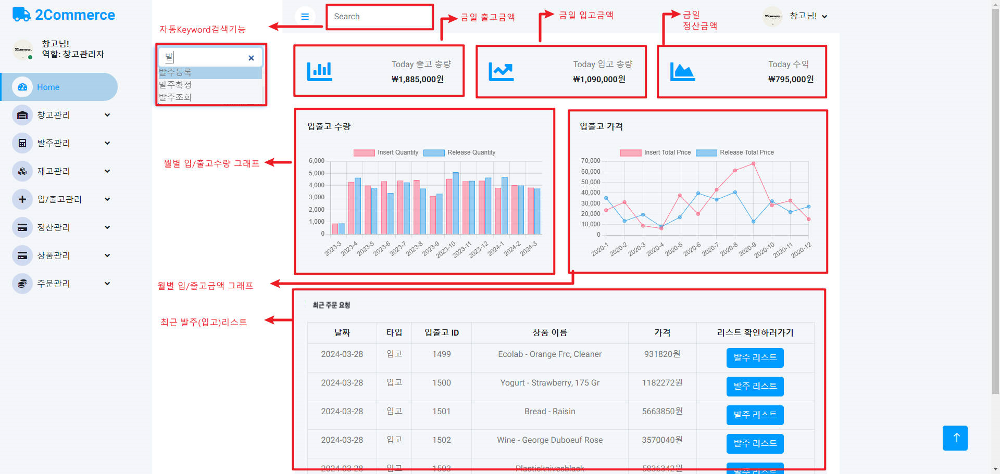
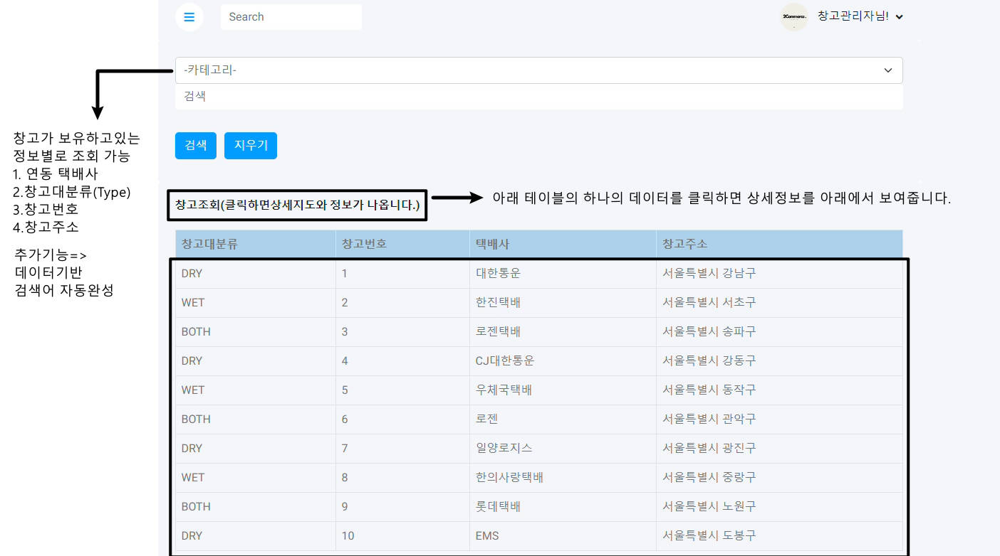
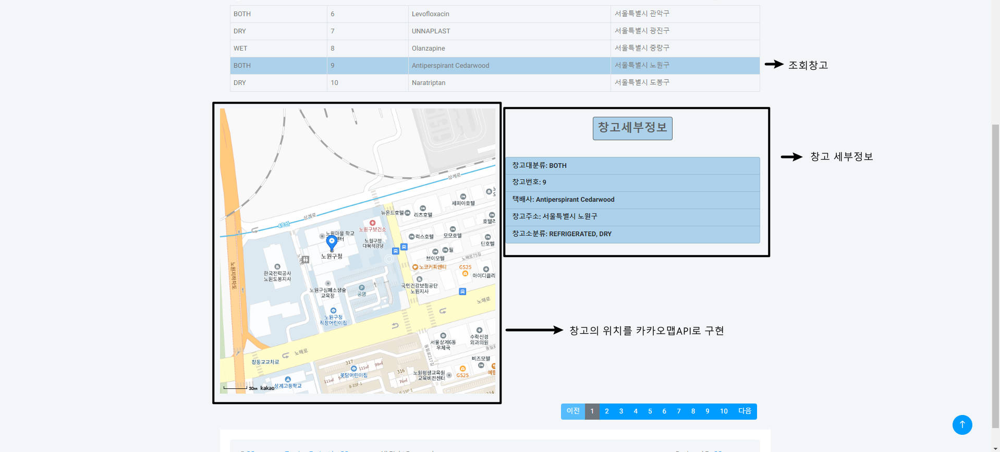

<h1>SSG 2차 프로젝트 - Team 2</h1>

<h2>WMS시스템 트레이닝</h2>

<h3>팀원 소개</h3>
<ul>
  <li>양성준 - 팀 리더, 개발환경 구성,입/출고관리</li>
  <li>최문석-  홈화면 ,창고관리,입/출고관리 </li>
  <li>백정훈 - 발주관리</li>
  <li>이도엽 - 주문관리</li>
  <li>문지환 - 재고관리</li>
  <li>이다혜 - 상품관리, 정산관리</li>
  <li>임태환 - 회원관리</li>
</ul>

<h3>🦾 사용한 기술스텍</h3>

<h3>📖회고</h3>
- 개발을 배운지 이제 90일(3개월) 정도가 되어가는 시점에 맞은 2번째 프로젝트

1. 백엔드를 시작으로 언어를 배우고 기술에 대한 전반적인 로직을 배운입장이라 CSS,HTML,JAVASCRPIT가 익숙하지않아서 어려움이 있었습니다.
2. 부트스트랩의 사용법도 쉽지않았습니다.
- 해결방안
    - 일단 직접 레이아웃을 작성하면서 진행을 하며 조금씩 구조에 익숙해지고 무엇이 필요한지를 생각한 후 부트스트랩을 적용하였습니다. 
    - 그렇게 차근차근 진행해가면서 사용자 친화적인 UI를 구성하였고, Mybatis와 스프링부트로 data를 보내면서 진행하였습니다.
    
### 그림예시

--- 

- 데쉬보드를 작성하면서 가장 합리적인 로직을 구현하려고 노력했고, 가장 적합한 데이터가 무엇이 있을지를 파악하고 그것을 HomePage에 구현하였습니다.

- Model 객체를 이용하여 data를 나눴습니다.
---

- Click 이벤트가 발생하였을때 상세페이지와 kakaoMap API를 이용한 지도를 표현하도록 구현하였습니다.

